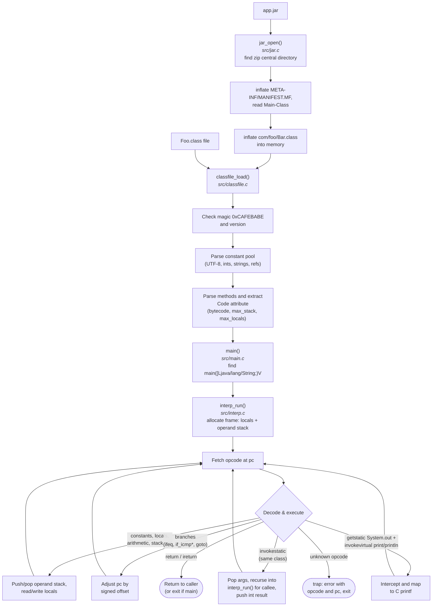

# minijvm

A tiny demonstration JVM written in pure C99. It parses a real Java `.class`
file and interprets a useful subset of JVM bytecode — enough to run programs
with int arithmetic, loops, branches, static method calls, recursion, and
`System.out.print`/`println`.

This is a teaching toy, not a real JVM: no objects, no GC, no exceptions,
no threads, no verifier, single class only.

## Build and run

```sh
make            # builds ./minijvm
make test       # compiles examples/Test.java with javac and runs it as a class and as a jar
make verify     # diffs minijvm against the real JVM: class, deflated jar, stored jar
make clean
```

You need a C compiler always, and a JDK (`javac`, `jar`) for `make test`/`verify`.
On macOS the Makefile automatically picks up a Homebrew OpenJDK if present.

To run any class file directly:

```sh
./minijvm path/to/Foo.class
```

Or run a jar, which reads `Main-Class` from its manifest:

```sh
./minijvm -jar path/to/app.jar
```

A jar is a zip archive, so `src/jar.c` contains a small zip reader and a
DEFLATE decompressor — no zlib, still pure C99. Only the class named by
`Main-Class` is loaded, so the single-class limit below still applies.

Trailing arguments are accepted so a real `java` command line can be pasted in
unchanged, but they are announced and dropped: handing them over would need a
`String[]`, and objects are the one thing the interpreter has none of. `main`
receives a null in local 0 regardless.

## Layout

- `src/classfile.c` / `.h` — binary `.class` file parser: magic, constant
  pool, methods, and the `Code` attribute (bytecode, max_stack, max_locals)
- `src/interp.c` / `.h` — loop-and-switch bytecode interpreter; one C stack
  frame per Java frame (`invokestatic` recurses in C)
- `src/jar.c` / `.h` — zip reader (central directory, stored and deflated
  entries) plus a from-scratch inflate, and `Main-Class` out of the manifest
- `src/main.c` — loads the class, finds `main([Ljava/lang/String;)V`, runs it
- `examples/Test.java` — demo exercising every supported feature

## How it works



Each Java method call gets one C stack frame: `invokestatic` simply calls
`interp_run` recursively, so Java recursion maps directly onto C recursion.
There is no heap and no object model — the only "object" is a dummy slot
pushed for `System.out`, and `print`/`println` calls on it are intercepted
and forwarded to `printf`.

## Supported bytecodes

| Group | Opcodes |
|---|---|
| Constants | `iconst_m1`..`iconst_5`, `bipush`, `sipush`, `ldc` (int and String) |
| Locals | `iload`, `istore` (incl. `_0`..`_3` forms), `iinc` |
| Arithmetic | `iadd`, `isub`, `imul`, `idiv`, `irem`, `ineg` |
| Stack | `pop`, `dup`, `nop` |
| Branches | `ifeq`..`ifle`, `if_icmpeq`..`if_icmple`, `goto` |
| Calls | `invokestatic` (same class, int params), `return`, `ireturn` |
| I/O | `getstatic System.out` + `invokevirtual PrintStream.print/println` intercepted and mapped to `printf` |
| Concatenation | `invokedynamic` `makeConcatWithConstants` for one int joined to constant text |

Anything else stops the interpreter with a clear error naming the opcode and
program counter.

## Notes for writing your own demo class

- Only `static` methods with `int` parameters and `int`/`void` returns are
  callable.
- String concatenation works only in the shape `"text " + anInt`, which javac
  compiles to a single `makeConcatWithConstants` call (see
  `examples/HelloWorld.java`). Joining two ints or another string is not
  supported; use separate `print` calls instead.
- In a jar, only the `Main-Class` is loaded. A call into any other class stops
  with `invokestatic to foreign class ... is unsupported`, so keep the whole
  demo in one class.

Video: [MiniJVMExplainer.mp4](/video/media/videos/minijvm_explainer/720p30/MiniJVMExplainer.mp4)
